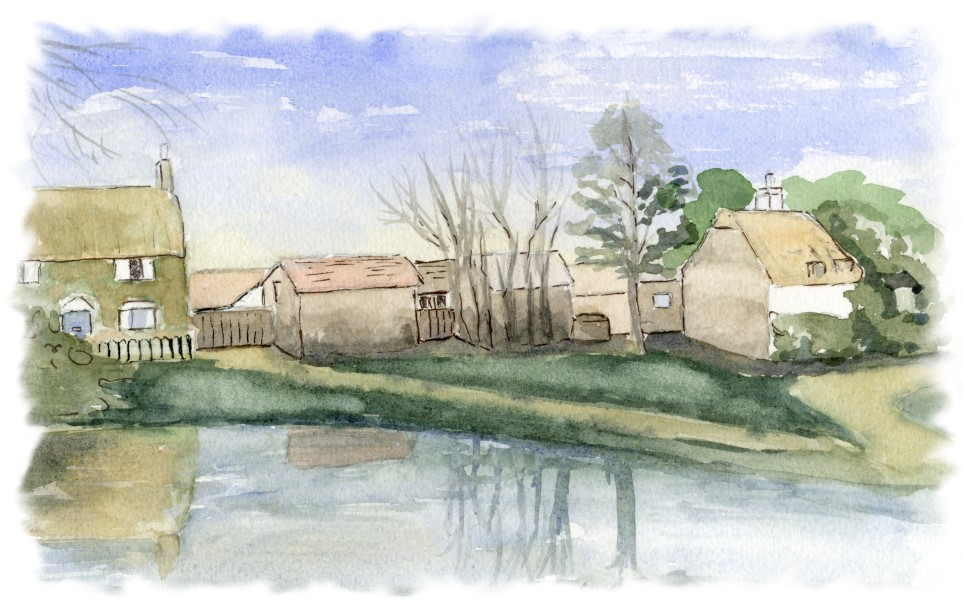
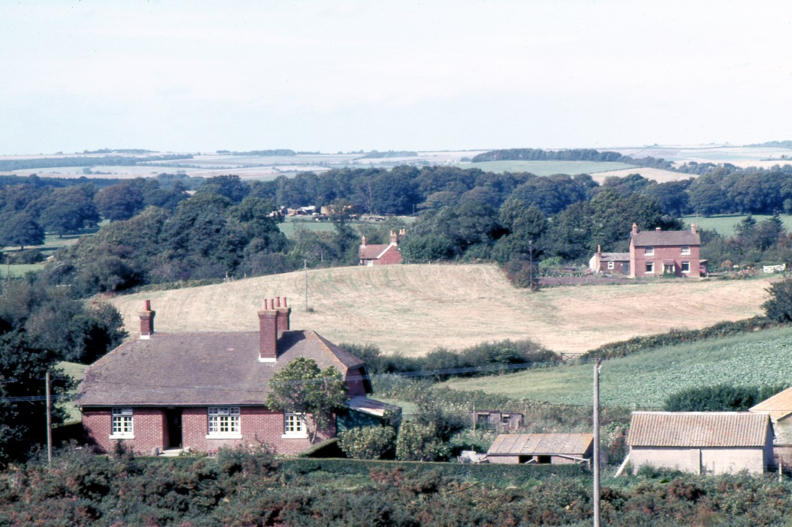
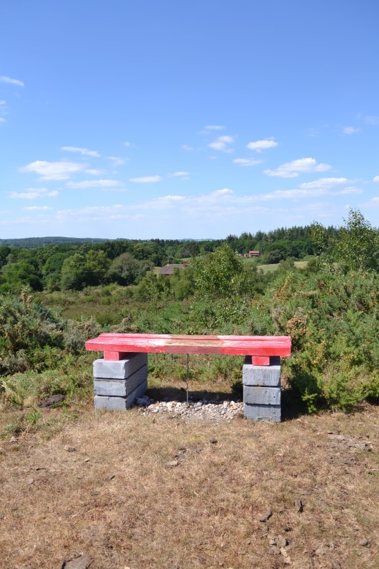
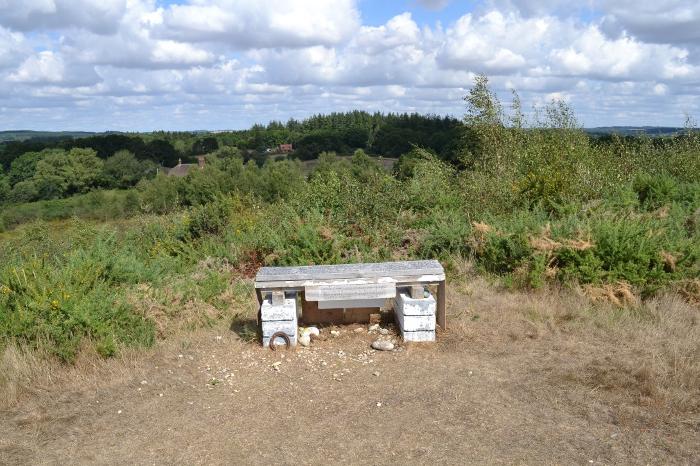
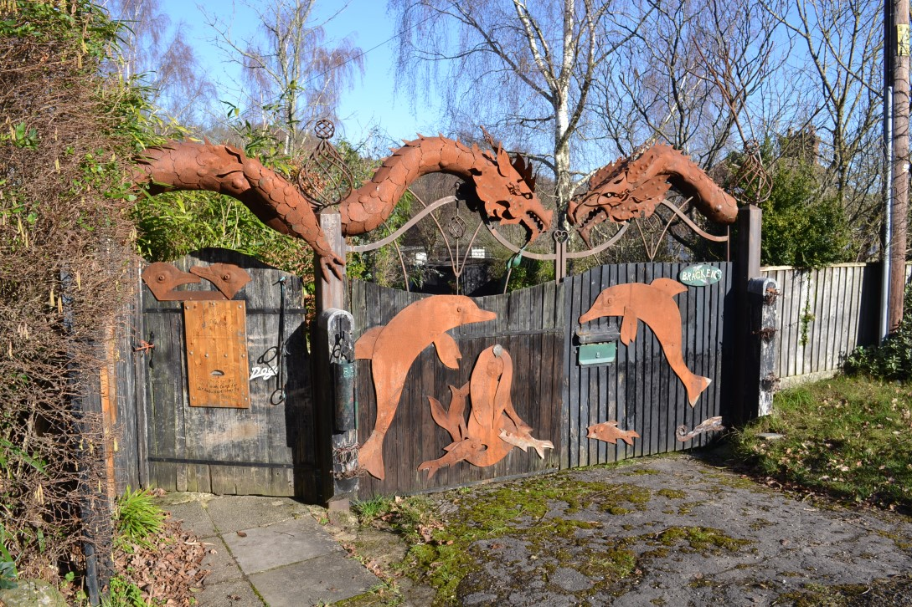
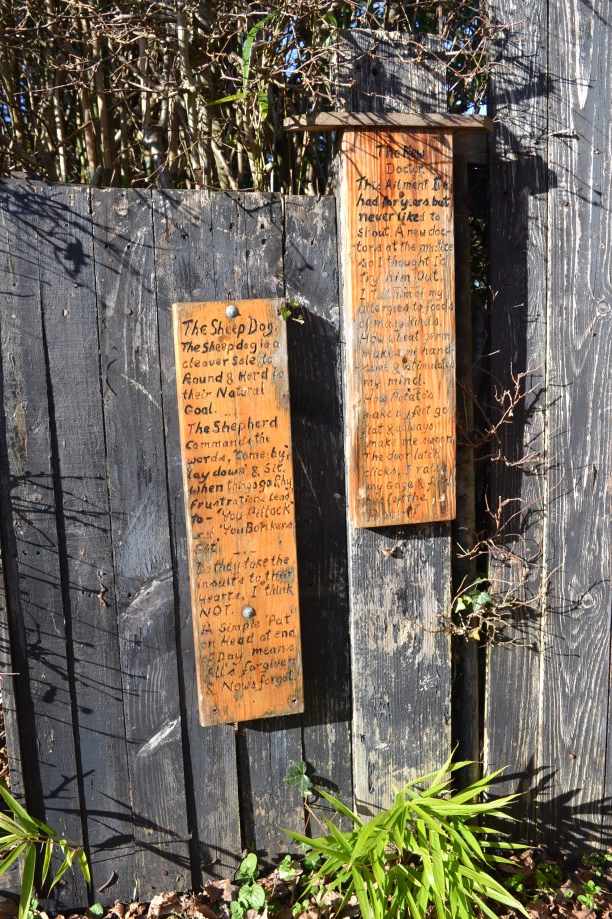
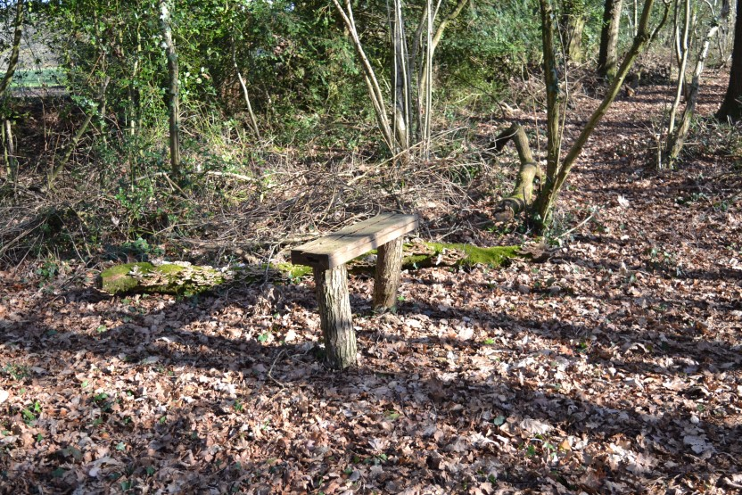
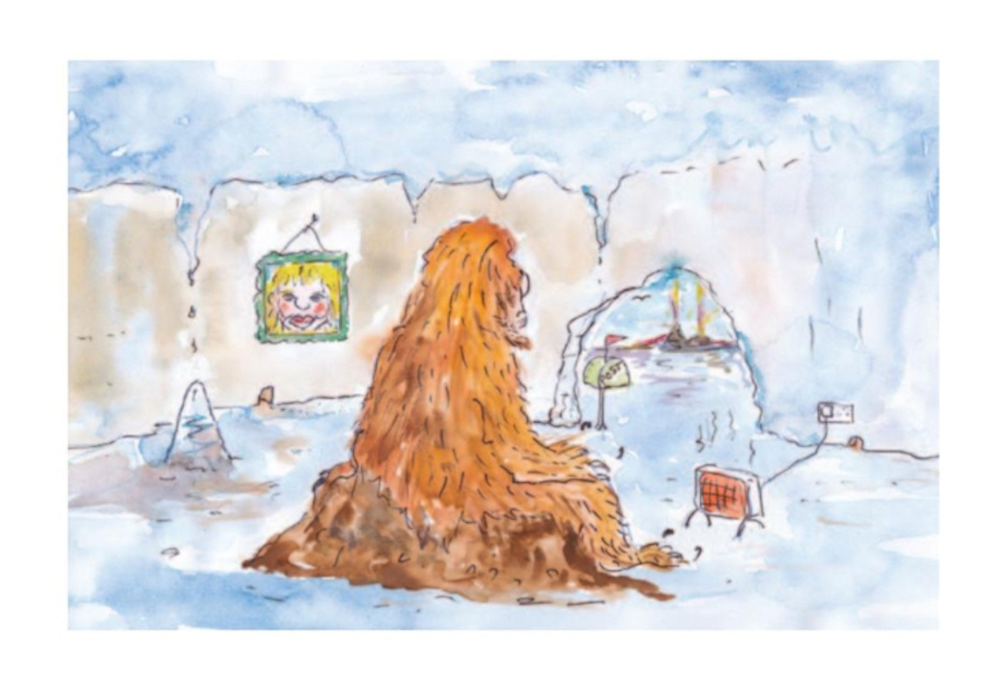
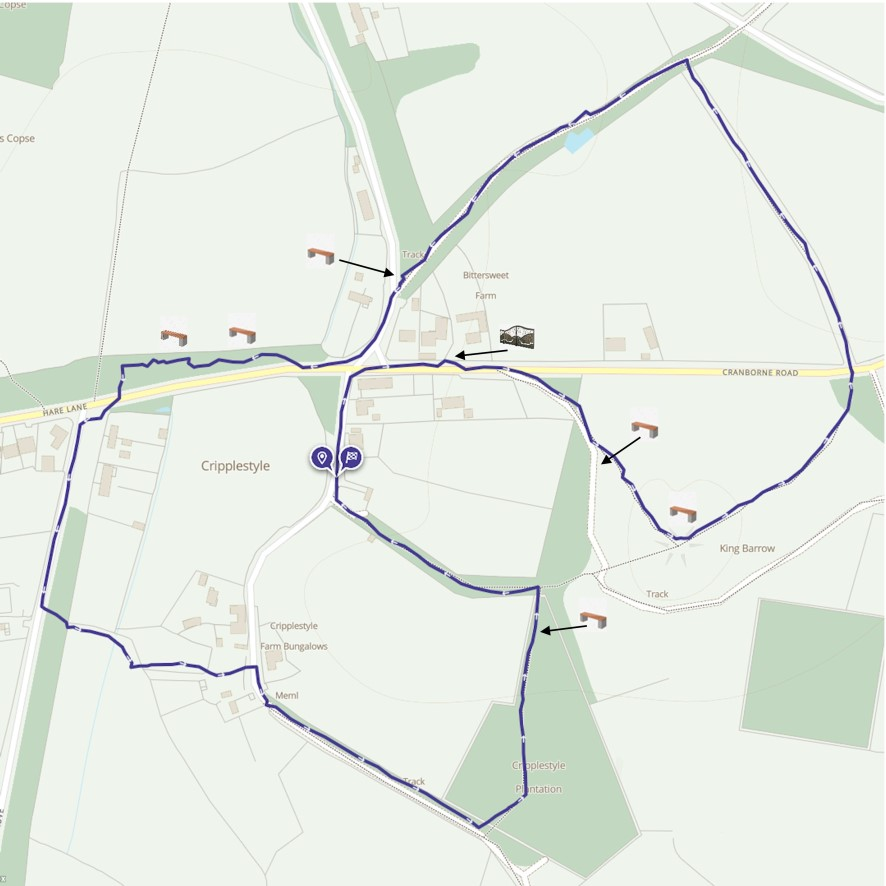

# Alderholt Archives
## The Cripplestyle Benches
### by Adrian King

If you travel from Alderholt to Cranborne, just before you reach Cripplestyle, on the left, behind the hedgerow you will just make out a small hill. It has the name King Barrow! It is a popular destination for short walks, with a panoramic view of the surrounding area when you reach the top!

At 324ft King Barrow is the highest hill in the district. The area consists of 23.62 acres of common land (registered units CL 253 and CL 162). The hill itself is not a tumulus but a natural mound.

On a clear day it was at one time possible to see the white cliffs of the Isle of Wight. I have in the past seen the flare stacks of the oil refinery at Fawley. It was also possible under the right conditions to see the top of Salisbury Cathedral spire. But the trees have grown so much that the distant view is now restricted. Clear cutting recently by the Cranborne Wild Heath Project has made new views possible.

*Figure 1: A view from King Barrow looking north in the 1970s*

On the Thursday following Whit Sunday the congregation of Cripplestyle Congregational Church processed to the top of the hill for an open-air service. During that day, from sunrise to sunset a flag flew with the message “Feed My Lambs.” This was to mark the anniversary of the opening of the Ebenezer Chapel in 1807.

Past forms of the name are, Kyngbor’ghe 1404 Cecil, Kingbarowe e17 CecilMap, Kingborrowe Heathe 1619 CH, King Barrow 1811 OS, King Barrowe Patch and Piece. The first bench on King Barrow that appeared in May 1846 TA and King Barrow Hill 1869 Hutch. From the Old English meaning *cyning* ‘king’ and *beorg* ‘barrow or hill.’ The current Ordnance Survey name is King Barrow.

The Local Defence Volunteers (LDV’s) held exercises on King Barrow. There is a legend that Uther the father of King Arthur is buried on the hill. In 1940 when the Home Guard were ‘dug-in’, no significant finds were made.

Between Thursday 28th and Sunday 31st May 2020 a bench was placed on the hill! The seat part was painted red and rested on breeze blocks being secured by a chain mounted on the centre of the seat and buried in the ground below. There was an inscription written on the seat.

*Figure 2: The first bench on King Barrow that appeared in May 2020*

By November 2020, the bench had been painted white and fixed to the breeze blocks without the need for the chain. The inscription that had been written on the top was now written on a board secured to the front of the bench. There were now three more poems written on the top of the bench.

*Figure 3: The King Barrow Bench in August 2022 showing the side panels with poems*

But who could be responsible for thoughtfully placing this seat on King Barrow? Research discovered that it was **Martin Hollister**, a poet who lived on Cranborne Road between Bittersweet and Sunny Corner. His gate was adorned with dragons and dolphins. Jean Bell said that there were spectacular iron dragons visible over the hedge including a 3-headed one and one with babies. There are two narrow panels on the left of the gate containing poetry.

*Figure 4: The dramatic gates at Martin Hollister’s property on Cranborne Road (sadly no longer there - Ed)*

*Figure 5: The Sheep Dog and the New Doctor poems, to the left of the gates on Cranborne Road*

Martin was not only responsible for the bench on King Barrow but other benches around Cripplestyle, some of which had poetry attached. There are two benches alongside the path he created in the strip of woodland between Cripplestyle crossroads and the Verwood turning - now mostly underwater!

*Figure 6: A bench in the woods between the Cripplestyle and Verwood turnings*

Martin placed lengths of fallen branches as edging to the path and drained water away from paths. On King Barrow, by January 2021 three more poems had been written and attached to a board on the back of the seat.

Over the next year and a half more boards were attached to the bench with more poems - in all there were over twelve poems on the bench. But by 27th December 2022 the bench had deteriorated - the poems were becoming faded and unreadable. The plywood panels were delaminating and by 6th February 2023 panels were beginning to drop off!

By the end of May 2023 all the panels had dropped off and later, some time in June 2023 the bench was removed. Martin, sadly died on 31st December 2022, but we still in pictures have the legacy of what his benches once looked like.

I have copies of all the poems if anybody is interested.

*Figure 7: An illustration of Michael from "Martin's Poem Book"*

### Michael

> Michael the Abominable Snowman has got no mate,  
> In his icy cave he ponders his lonely fate,  
> He writes his “love wishing” letters to Heart Club columns,  
> And sits alone all day to plan a hopeful date.

This was one of the first poems on the King Barrow Bench.

*Figure 8: A figure-of-eight walk around Cripplestyle that included most of the benches, and Martin Hollister’s dramatic gates*
